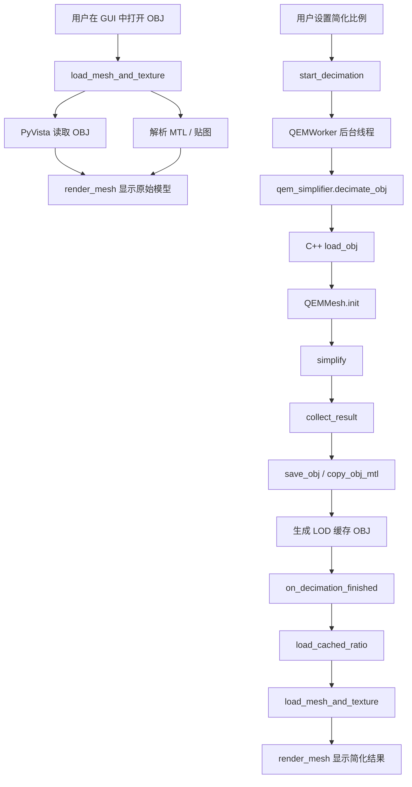

# 模块说明与接口调用关系

本文档用于说明 Mesh Simplifier 项目的主要模块、模块职责、接口关系和一次网格简化任务的执行流程。项目整体采用“Python GUI + C++ 算法扩展”的结构：Python 负责界面、文件管理和三维显示，C++ 负责网格简化计算。

## 1. 项目模块划分

```text
GUI/
├─ MeshSimplifier_App/              # 可直接运行的应用包
│  ├─ app/
│  │  ├─ mesh_simplifier.py         # GUI 主程序
│  │  └─ qem_simplifier/
│  │     └─ qem_simplifier.*.pyd    # 已编译 C++ 扩展
│  ├─ python/                       # 便携 Python 环境
│  └─ Run_MeshSimplifier.bat        # 启动脚本
├─ MeshSimplifier_Source/           # 源码目录
│  ├─ mesh_simplifier.py            # GUI 源码
│  └─ qem_simplifier/
│     ├─ src/                       # C++ 算法源码
│     ├─ setup.py                   # Python 扩展构建脚本
│     ├─ CMakeLists.txt             # CMake 构建脚本
│     └─ qem_simplifier.*.pyd       # 编译后的扩展模块
├─ requirements.txt                 # Python 依赖
└─ README.md
```

## 2. Python GUI 模块

主要文件：

```text
MeshSimplifier_Source/mesh_simplifier.py
MeshSimplifier_App/app/mesh_simplifier.py
```

两个文件内容保持一致。`MeshSimplifier_Source` 用于继续开发，`MeshSimplifier_App` 用于直接运行。

### 2.1 文件与纹理解析函数

| 函数 | 作用 |
| --- | --- |
| `parse_obj_mtl_path(obj_path)` | 从 OBJ 文件中解析 `mtllib`，得到 MTL 文件路径 |
| `parse_mtl_texture_path(mtl_path)` | 从 MTL 文件中读取单贴图路径 |
| `parse_mtl_texture_paths(mtl_path)` | 从 MTL 文件中读取多个材质对应的贴图路径 |
| `build_multi_texture_payload(mesh, texture_paths)` | 将 PyVista 读入的网格按材质拆分，并绑定对应贴图 |
| `load_mesh_and_texture(obj_path)` | 统一加载 OBJ、MTL 和贴图，返回 `mesh, texture` |

这部分主要处理 OBJ/MTL/贴图之间的路径关系。对于多材质模型，程序会根据 PyVista 读取到的材质信息拆分网格，使不同材质区域能够使用不同贴图。

### 2.2 GUI 主窗口 `MainWindow`

`MainWindow` 继承自 `QtWidgets.QMainWindow`，是整个程序的主界面类。

主要职责：

- 创建界面控件和布局
- 加载 OBJ 模型
- 控制简化比例输入
- 调用 C++ 扩展执行简化
- 管理 LOD 缓存
- 调用 PyVista/VTK 显示模型
- 导出简化结果

常用方法如下：

| 方法 | 作用 |
| --- | --- |
| `init_ui()` | 初始化界面布局、按钮、滑条、3D 视窗 |
| `open_file_dialog()` | 打开文件选择框并加载 OBJ |
| `render_mesh(mesh, texture, reset_camera)` | 在 3D 视窗中渲染模型 |
| `toggle_texture()` | 开关贴图显示 |
| `toggle_wireframe()` | 开关网格线显示 |
| `sync_ratio_controls()` | 同步滑条和手动比例输入框 |
| `start_decimation(ratio)` | 按指定比例启动后台简化任务 |
| `load_cached_ratio(ratio)` | 加载已生成的 LOD 缓存 |
| `export_current_obj()` | 导出当前显示的 OBJ 结果 |
| `clear_cache()` | 清空本地 LOD 缓存 |

### 2.3 后台简化线程 `QEMWorker`

`QEMWorker` 继承自 `QtCore.QThread`，用于避免简化计算阻塞 GUI。

核心调用位于 `run()`：

```python
qem_simplifier.decimate_obj(str(OBJ_PATH), str(self.output_path), ratio)
```

其中：

- `OBJ_PATH` 是当前输入模型路径
- `output_path` 是简化后 OBJ 的缓存输出路径
- `ratio` 是目标保留比例，例如 `0.2` 表示保留约 20% 面片

任务结束后，线程通过信号 `finished` 通知主界面加载结果。

## 3. C++ 扩展模块

主要目录：

```text
MeshSimplifier_Source/qem_simplifier/src/
```

该目录中的 C++ 代码通过 pybind11 编译为 Python 扩展：

```text
qem_simplifier.cp312-win_amd64.pyd
```

Python 中可以直接：

```python
import qem_simplifier
```

### 3.1 C++ 文件职责

| 文件 | 作用 |
| --- | --- |
| `pybind_module.cpp` | Python 与 C++ 的绑定入口，暴露 `decimate` 和 `decimate_obj` |
| `qem_decimate.h` | QEM 简化核心，包括邻接构建、边折叠、代价计算、结果收集 |
| `obj_io.h` | OBJ/MTL 读取与写出，保留 UV 和材质信息 |
| `quadric.h` | 三维几何二次误差矩阵 |
| `quadric5.h` | 五维二次误差矩阵，用于联合考虑几何与 UV |
| `math_utils.h` | 向量、矩阵、插值等基础数学函数 |

## 4. Python 调用的 C++ 接口

扩展模块暴露两个主要接口。

### 4.1 `decimate`

```python
vertices_out, faces_out, uvs_out = qem_simplifier.decimate(
    vertices,
    faces,
    target_ratio=0.5,
    symmetry_axis=-1,
    symmetry_eps=2e-5,
    uvs=None,
)
```

接口说明：

| 参数 | 类型 | 说明 |
| --- | --- | --- |
| `vertices` | `numpy.ndarray (N, 3)` | 输入顶点坐标 |
| `faces` | `numpy.ndarray (M, 3)` | 输入三角面索引 |
| `target_ratio` | `float` | 目标保留比例 |
| `symmetry_axis` | `int` | 对称轴参数，默认不启用 |
| `symmetry_eps` | `float` | 对称判断容差 |
| `uvs` | `numpy.ndarray` 或 `None` | UV 数据，可为顶点 UV 或面角 UV |

返回值：

| 返回值 | 说明 |
| --- | --- |
| `vertices_out` | 简化后的顶点 |
| `faces_out` | 简化后的三角面 |
| `uvs_out` | 简化后的面角 UV |

该接口适合直接传入数组进行算法测试，但当前 GUI 主要使用 `decimate_obj`。

### 4.2 `decimate_obj`

```python
out_vertices, out_faces = qem_simplifier.decimate_obj(
    input_path,
    output_path,
    target_ratio=0.5,
    symmetry_axis=-1,
)
```

接口说明：

| 参数 | 类型 | 说明 |
| --- | --- | --- |
| `input_path` | `str` | 输入 OBJ 文件路径 |
| `output_path` | `str` | 输出 OBJ 文件路径 |
| `target_ratio` | `float` | 目标保留比例 |
| `symmetry_axis` | `int` | 对称轴参数，默认不启用 |

返回值：

| 返回值 | 说明 |
| --- | --- |
| `out_vertices` | 输出顶点数量 |
| `out_faces` | 输出面片数量 |

GUI 中的后台线程直接调用该接口。该接口会在 C++ 内部完成 OBJ 读取、QEM 简化、OBJ 写出和 MTL 复制。

## 5. 接口调用关系

整体调用关系如下：



## 6. 一次简化任务的执行流程

1. 用户在界面中选择 OBJ 文件。
2. `open_file_dialog()` 设置全局输入路径 `OBJ_PATH`。
3. `load_mesh_and_texture()` 读取模型、MTL 和贴图。
4. `render_mesh()` 在 PyVista 视窗中显示原始模型。
5. 用户通过滑条、预设按钮或输入框设置目标简化比例。
6. `start_decimation()` 根据比例生成缓存输出路径。
7. 程序创建 `QEMWorker` 后台线程。
8. `QEMWorker.run()` 调用 `qem_simplifier.decimate_obj()`。
9. C++ 扩展读取 OBJ，构建 `QEMMesh`。
10. `simplify()` 使用 QEM 代价选择边折叠。
11. 简化结束后，C++ 写出新的 OBJ，并复制对应 MTL/贴图引用。
12. 线程返回结果，GUI 调用 `load_cached_ratio()` 加载简化后模型。
13. `render_mesh()` 显示新的 LOD 结果。

## 7. C++ 简化核心流程

`qem_decimate.h` 中的核心对象是 `QEMMesh`。

主要数据包括：

- 顶点坐标 `co`
- 面片索引 `faces`
- 边列表 `edges`
- 顶点、面、边之间的邻接关系
- 法线信息
- 面角 UV
- 材质 ID
- QEM 几何误差与纹理误差相关数据

核心流程：

```text
QEMMesh.init
  ├─ 读取顶点、面、UV、材质
  ├─ build_adjacency
  ├─ compute_face_geometry
  └─ compute_vert_normals

simplify
  ├─ 初始化每个顶点的 quadric
  ├─ 初始化边折叠代价
  ├─ 将候选边加入优先队列
  ├─ 循环取出代价最低的边
  ├─ 检查拓扑、边界、UV seam、材质边界等约束
  ├─ 执行 edge_collapse
  ├─ 更新相关邻接和代价
  └─ 达到目标面数后 collect_result
```

## 8. 纹理与多材质处理

本项目中纹理保护主要体现在两个层面：

### 8.1 Python 显示层

Python 负责解析 MTL 文件中的材质和贴图路径。对于多材质模型，程序会生成一个 multi-texture payload：

```python
{
    "type": "multi_texture",
    "parts": [
        {"mesh": part_mesh, "texture": texture},
        ...
    ]
}
```

`render_mesh()` 根据该结构分别渲染每个材质区域。

### 8.2 C++ 简化层

C++ 中保存面角 UV 和材质 ID。边折叠时会考虑：

- UV seam 是否跨越
- 材质边界是否跨越
- 折叠后 UV 变化是否过大
- 几何误差与 UV 误差的联合代价

`quadric5.h` 中的五维 quadric 用于把 `(x, y, z, u, v)` 联合起来评估折叠代价，使简化时不仅关注几何形状，也尽量保持纹理映射稳定。

## 9. 缓存与导出关系

简化结果会先写入本地缓存目录：

```text
_lod_cache/
```

缓存文件命名方式由 `cache_path_for_ratio(ratio)` 控制，一般形式为：

```text
模型名_lod_020.obj
模型名_lod_050.obj
```

导出时，`export_current_obj()` 会将当前显示的 OBJ、MTL 和贴图相关文件复制到用户选择的位置。这样用户可以先预览多个比例，再选择满意的结果导出。

## 10. 构建关系

C++ 扩展可以通过 `setup.py` 编译：

```powershell
cd MeshSimplifier_Source\qem_simplifier
python setup.py build_ext --inplace
```

编译后生成：

```text
qem_simplifier.cp312-win_amd64.pyd
```

GUI 运行时会在 `qem_simplifier` 目录中查找该 `.pyd` 文件，并通过 `importlib.util` 手动加载。

## 11. 模块间依赖总结

| 模块 | 依赖 | 被谁调用 |
| --- | --- | --- |
| `mesh_simplifier.py` | PyQt5、PyVista、NumPy、qem_simplifier | 应用入口 |
| `QEMWorker` | qem_simplifier | `MainWindow.start_decimation()` |
| `qem_simplifier.pyd` | C++ STL、pybind11 | Python GUI |
| `pybind_module.cpp` | qem_decimate.h、obj_io.h | Python import |
| `qem_decimate.h` | math_utils.h、quadric.h、quadric5.h | pybind_module.cpp |
| `obj_io.h` | C++ 文件 IO | pybind_module.cpp |
| `quadric.h` | math_utils.h | qem_decimate.h |
| `quadric5.h` | quadric.h、math_utils.h | qem_decimate.h |

## 12. 维护建议

- 修改 GUI 时，优先改 `MeshSimplifier_Source/mesh_simplifier.py`。
- 修改完成并测试通过后，再同步到 `MeshSimplifier_App/app/mesh_simplifier.py`。
- 修改 C++ 算法后，需要重新编译 `.pyd`。
- 如果要更新应用包，需要同时同步新的 `mesh_simplifier.py` 和 `.pyd`。
- GitHub 仓库中不建议提交完整 `python/` 便携环境，依赖应通过 `requirements.txt` 安装。
